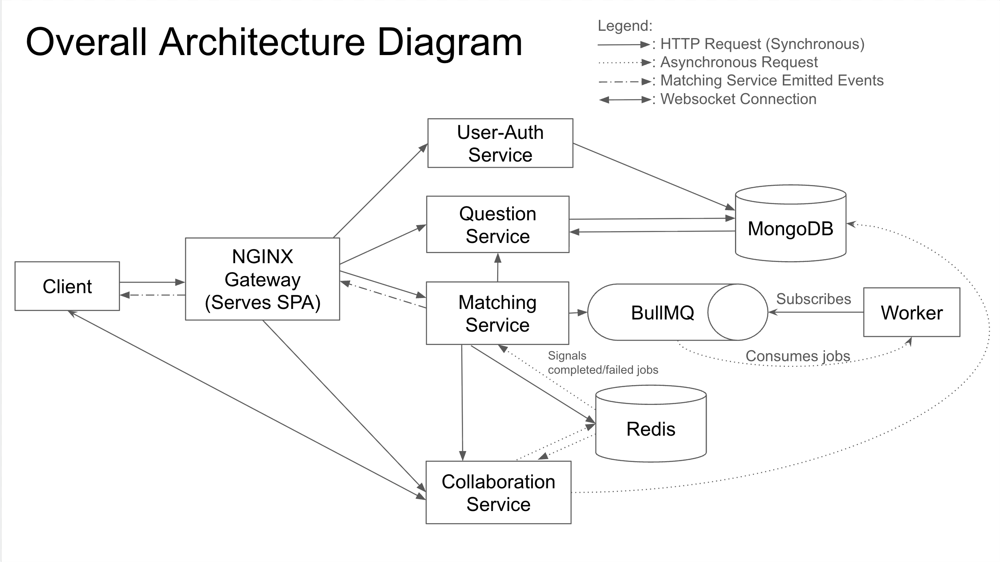

# CS3219 Project: PeerPrep

A comprehensive overview of PeerPrep, a real-time peer programming interview preparation platform where users can match with peers, collaborate on coding problems, and chat in real-time. This document covers the containerization strategy and deployment architecture of PeerPrep specifically in terms of Docker-based microservice architecture, container configurations, and deployment patterns. `master` is the working production branch and `dev` is the development branch.

## Table of Contents

- [Quick Start](#quick-start)
- [Architecture Overview](#architecture-overview)
- [Service Documentation](#service-documentation)
- [API Documentation](#api-documentation)
- [Design Choices](#design-choices)
- [Runbooks](#runbooks)

## Quick Start

### Prerequisites

- Docker Engine 20.10+
- Docker Compose 2.0+
- Node.js 22+ (for local development without containers)

### Running with Docker Compose

```bash
# Start all services in development mode (first build)
docker-compose up --build

# Start all services in development mode
docker-compose up

# Start services in the background
docker-compose up -d

# View logs from all services
docker-compose logs -f

# Stop all services
docker-compose down

# Clean up volumes (removes persistent data)
docker-compose down -v
```

The application will be available at:
- **Frontend**: `http://localhost:80` or `http://localhost` (through nginx)
- **API Base**: `/api/` (proxied through nginx)

## Architecture Overview

### Microservices Architecture

PeerPrep is built as a collection of containerized microservices communicating through a central nginx gateway:



### Container Architecture

**Network**: `leetcode_collab_net` (custom bridge network)
- All services communicate via internal container DNS
- Services are referenced by container name (e.g., `http://auth-service:8000`)

**Volumes**:
- `mongo-data`: Persistent MongoDB data
- `./logs/nginx`: Nginx access/error logs (bind mount)
- `./auth-service`, `./frontend`, etc.: Development source code

**Service Interdependencies**:
- Nginx depends on: User-Auth Service, Question Service
- User-Auth Service depends on: MongoDB
- Question Service depends on: MongoDB
- Matching Service depends on: Redis
- Collab Service depends on: MongoDB, Redis
- Chat Service: No external dependencies

## Service Documentation

### 1. Nginx Gateway Container

**Purpose**: Central reverse proxy and API gateway

**Image**: Custom multi-stage build from `nginx:alpine`

**Ports**: 
- `80` (HTTP)

**Volumes**:
- `/var/log/nginx` (bind mount to `./logs/nginx`)
- `/etc/nginx/nginx.conf` (bind mount from `./nginx-gateway/config/nginx.conf`)
- `/usr/share/nginx/html` (contains frontend static assets)

**Key Features**:
- Serves frontend React static files (built in Stage 1)
- Proxies API requests to backend microservices
- JWT verification for protected endpoints
- WebSocket upgrade support (Connection: upgrade)
- JSON-formatted logging for analytics
- Gzip compression for all text-based responses

**Dockerfile Strategy**: Multi-stage build
```
Stage 1: Build frontend React app (node:22-alpine)
  └─ npm install & npm run build
  └─ Outputs: /app/dist (built static files)

Stage 2: Nginx server (nginx:alpine)
  └─ COPY --from=builder /app/dist /usr/share/nginx/html
  └─ Runs nginx with custom configuration
```

**Related Files**: 
- [`./nginx-gateway/README.md`](./nginx-gateway/README.md)

**Configuration Highlights**:
- SPA fallback: All unknown routes redirect to `/index.html`
- Cache control: HTML files cached with `no-cache` directive
- Compression: gzip enabled for JSON, JavaScript, CSS
- Large header buffer: 32KB for handling large JWT tokens
- Connection upgrade maps for WebSocket support

**Related Files**: 
- [`./nginx-gateway/Dockerfile`](./nginx-gateway/Dockerfile)
- [`./nginx-gateway/config/nginx.conf`](./nginx-gateway/config/nginx.conf)

---

### 2. User-Auth Service Container

**Purpose**: JWT-based authentication and user management

**Image**: Node.js 22 Alpine with TypeScript

**Ports**:
- `8000` (HTTP API)

**Environment Variables**:
```bash
DB_LOCAL_URI=mongodb://mongo:27017
DB_NAME=PeerPrepAuthDB
AUTH_PORT=8000
BETTER_AUTH_SECRET=[secret key]
BETTER_AUTH_URL=http://localhost:8000
FRONTEND_URL=http://localhost:80
```

**Base Technology**: Express.js + Better Auth + Mongoose

**Dockerfile Strategy**: Development-optimized
```dockerfile
FROM node:22-alpine
WORKDIR /app
COPY package*.json ./
RUN npm install  # Includes devDependencies for ts-node
COPY . .
EXPOSE 8000
CMD ["npm", "run", "dev"]  # Uses nodemon + ts-node
```

**Volume Mounts**:
- `/app` (bind mount to `./auth-service`)
- `/app/node_modules` (anonymous volume) - isolated node_modules

**Dependencies**:
- `better-auth`: JWT & session management
- `mongoose`: MongoDB ORM
- `express`: HTTP framework
- `cors`: Cross-origin request handling
- `resend`: Email sending (registration confirmations)

**Related Files**:
- [`./auth-service/Dockerfile.dev`](./auth-service/Dockerfile.dev)
- [`./auth-service/package.json`](./auth-service/package.json)
- [`./auth-service/src/server.ts`](./auth-service/src/server.ts)

---

### 3. Question Service Container

**Purpose**: Coding problem repository and retrieval

**Image**: Node.js 22 (standard, not Alpine)

**Ports**:
- `3013` (HTTP API)

**Environment Variables**:
```bash
DB_LOCAL_URI=mongodb://mongo:27017
```

**Base Technology**: Express.js + Mongoose


**Dockerfile Strategy**: Standard development setup
```dockerfile
FROM node:22
WORKDIR /app
COPY package*.json ./
RUN npm install
COPY . .
EXPOSE 3000  # Note: Config may differ
CMD ["npm", "start"]
```

**Volume Mounts**:
- `/app` (bind mount to `./question-service`)
- `/app/node_modules` (anonymous volume)

**Dependencies**:
- `mongoose`: MongoDB ORM
- `express`: HTTP framework
- `cors`: CORS middleware

**Related Files**:
- [`./question-service/dockerfile`](./question-service/dockerfile)
- [`./question-service/package.json`](./question-service/package.json)
- [`./question-service/server.js`](./question-service/server.js)

---

### 4. Matching Service Container

**Purpose**: Real-time peer matching with queue management

**Image**: Node.js 22 Alpine

**Ports**:
- `3001` (HTTP API)

**Environment Variables**:
```bash
REDIS_HOST=redis
REDIS_PORT=6379
JWT_SECRET=[secret]
```

**Base Technology**: Express.js + BullMQ (job queue) + Redis

**Dockerfile Strategy**: Production-optimized with non-root user
```dockerfile
FROM node:22-alpine
RUN mkdir -p /home/node/app && chown -R node:node /home/node/app
WORKDIR /usr/src/app
COPY package*.json ./
RUN npm install --production=false
COPY . .
EXPOSE 3001
USER node  # Run as non-root
CMD ["npm", "run", "dev"]
```

**Security Features**:
- Non-root user execution
- Explicit ownership of directories
- Separated application directory from root

**Volume Mounts**:
- `/app` (bind mount to `./matching-service`)
- `/app/node_modules` (anonymous volume)

**Key Technology**: BullMQ for job queueing
- Uses Redis as backend
- Supports job retries and failure handling

**Related Files**:
- [`./matching-service/Dockerfile`](./matching-service/Dockerfile)
- [`./matching-service/package.json`](./matching-service/package.json)
- [`./matching-service/src/server.js`](./matching-service/src/server.js)

---

### 5. Collab Service Container

**Purpose**: Real-time collaborative code editor

**Image**: Node.js 22 Alpine

**Ports**:
- `8081` (WebSocket for code editing)

**Environment Variables**:
```bash
COLLAB_HOST=0.0.0.0
COLLAB_PORT=8081
DB_LOCAL_URI=mongodb://mongo:27017
YJS_DB_NAME=yjs-docs
YJS_COLLECTION_NAME=documents
```

**Base Technology**: Yjs WebSocket server + Mongoose (for persistence)

**Key Protocol**: Yjs CRDT (Conflict-free Replicated Data Type)
- Real-time synchronization of document updates
- Automatic conflict resolution
- Binary protocol over WebSocket

**Dockerfile Strategy**: Production-optimized with non-root user
```dockerfile
FROM node:22-alpine
RUN mkdir -p /home/node/app && chown -R node:node /home/node/app
WORKDIR /home/node/app
COPY --chown=node:node package*.json ./
USER node
RUN npm install
COPY --chown=node:node . .
EXPOSE 8081
CMD ["npm", "start"]
```

**Volume Mounts**:
- `/app` (bind mount to `./collab/server`)
- `/app/node_modules` (anonymous volume)

**WebSocket Connection**:
- URL: `ws://localhost/api/collab/room/{matchToken}`
- Query params: `userId`, `token` (JWT)
- Persists collaborative edits to MongoDB

**Related Files**:
- [`./collab/server/Dockerfile`](./collab/server/Dockerfile)
- [`./collab/server/package.json`](./collab/server/package.json)
- [`./collab/server/src/server.js`](./collab/server/src/server.js)

---

### 6. Chat Service Container

**Purpose**: Real-time messaging during collaboration

**Image**: Node.js 22 Alpine

**Ports**:
- `8082` (WebSocket for chat)

**Environment Variables**:
```bash
CHAT_PORT=8082
```

**Base Technology**: Yjs WebSocket server (message synchronization)

**Key Protocol**: Yjs Y.Array for message persistence
- Messages stored as CRDT array
- Automatic sync across connected clients
- No external database dependency

**Dockerfile Strategy**: Production-optimized with non-root user
```dockerfile
FROM node:22-alpine
RUN mkdir -p /home/node/app && chown -R node:node /home/node/app
WORKDIR /home/node/app
COPY --chown=node:node package*.json ./
USER node
RUN npm install
COPY --chown=node:node . .
EXPOSE 8082
CMD ["node", "server.js"]
```

**Volume Mounts**:
- `/app` (bind mount to `./chat`)
- `/app/node_modules` (anonymous volume)

**WebSocket Connection**:
- URL: `ws://localhost/api/chat`
- Query params: `userId`, `token` (JWT)

**Related Files**:
- [`./chat/Dockerfile`](./chat/Dockerfile)
- [`./chat/package.json`](./chat/package.json)
- [`./chat/server.js`](./chat/server.js)

---

### 7. Frontend Container

**Purpose**: React SPA served through nginx

**Image**: Node.js 22 Alpine (development mode)

**Ports**:
- `5173` (Vite dev server)

**Environment Variables**:
```bash
CHOKIDAR_USEPOLLING=true 
VITE_API_BASE_URL=/api
```

**Base Technology**: Vite + React 19

**Dockerfile Strategy**: Development
```dockerfile
FROM node:22-alpine
WORKDIR /app
COPY package*.json ./
RUN npm install
COPY . .
EXPOSE 5173
CMD ["npm", "run", "dev"]
```

**Volume Mounts**:
- `/app` (bind mount to `./frontend`) 
- `/app/node_modules` (anonymous volume)

**Build Output**: 
- In production nginx gateway: `/usr/share/nginx/html` (static files)

**API Proxy Configuration**:
- All requests to `/api` are proxied through nginx gateway
- JWT tokens passed via Authorization header
- Supports WebSocket upgrades for collab and chat

**Related Files**:
- [`./frontend/Dockerfile.dev`](./frontend/Dockerfile.dev)
- [`./frontend/package.json`](./frontend/package.json)
- [`./frontend/vite.config.ts`](./frontend/vite.config.ts)

---

### 8. MongoDB Container

**Purpose**: Primary database for services

**Image**: `mongo:7` (official MongoDB image)

**Ports**:
- `27017` (MongoDB protocol)

**Volumes**:
- `mongo-data` (named volume) - persistent data storage

**Collections**:
- `users` - User authentication data
- `questions` - Coding problems
- `question_attempts` - User attempt history
- `documents` - Yjs collaborative document states

**Startup Command**: Default MongoDB server

**Related Files**:
- `docker-compose.yml` (service definition)

---

### 9. Redis Container

**Purpose**: In-memory cache and job queue backend

**Image**: `redis:7-alpine` (official Redis image)

**Ports**:
- `6379` (Redis protocol)

**Configuration**:
```bash
command: redis-server --appendonly no --save ""
```
- Disables persistence (AOF off, RDB snapshots off)
- Suitable for ephemeral queue data

**Used By**:
- Matching Service: BullMQ job queue
- Collab Service: Optional caching

**Related Files**:
- `docker-compose.yml` (service definition)

---

## API Documentation

Detailed API documentation can be found in each of the microservices' README files, tagged below. 

- [`./auth-service/README.md`](./auth-service/README.md)
- [`./chat/README.md`](./chat/README.md)
- [`./collab/server/README.md`](./collab/server/README.md)
- [`./frontend/README.md`](./frontend/README.md)
- [`./matching-service/README.md`](./matching-service/README.md)
- [`./nginx-gateway/README.md`](./nginx-gateway/README.md)
- [`./question-service/README.md`](./question-service/README.md)

---

## Design Choices

### 1. Microservices Architecture with Nginx Gateway

**Rationale**:
- **Service Isolation**: Each microservice has independent deployment, scaling, and technology choices
- **Loose Coupling**: Services communicate through HTTP/WebSocket, not shared databases
- **Technology Diversity**: Auth uses TypeScript, Matching uses Node.js with BullMQ, etc.
- **Gateway Pattern**: Single entry point (nginx) simplifies routing, security, and logging

**Trade-offs**:
- Network overhead between services vs. modularity
- Operational complexity vs. independent scaling
- Distributed debugging vs. service independence

**Key File**: [`./nginx-gateway/config/nginx.conf`](./nginx-gateway/config/nginx.conf)

---

### 2. Container Runtime Optimization

**Development vs. Production**:

| Aspect | Development | Production |
|--------|-------------|-----------|
| Base Image | Alpine (smaller) | Alpine (smaller) |
| Node version | node:22-alpine | node:22-alpine |
| Nodemon | Included | Excluded |
| Source Mounts | Bind mount (/app) | COPY (built-in) |
| User | root (default) | node (non-root) |
| CMD | npm run dev | npm start |

**Security Features**:
- **Non-root User** (collab, chat, matching): Prevents container escape
- **Directory Ownership** (`chown -R node:node`): Ensures user can write
- **Layer Caching**: `COPY package*.json` before source code

**Example (Matching Service)**:
```dockerfile
FROM node:22-alpine
RUN mkdir -p /usr/src/app && chown -R node:node /usr/src/app
WORKDIR /usr/src/app
COPY --chown=node:node package*.json ./
USER node  # Switch to non-root
RUN npm install
COPY --chown=node:node . .
EXPOSE 3001
CMD ["npm", "run", "dev"]
```

---

### 3. Multi-Stage Build for Nginx Gateway

**Why Two Stages?**

```
Stage 1 (Builder): 
  - Uses node:22-alpine (contains npm, node)
  - Installs dependencies
  - Runs npm run build
  - Outputs: /app/dist (minified React app)
  
Stage 2 (Runtime):
  - Uses nginx:alpine (lightweight, no Node.js)
  - COPYs only /app/dist from builder
  - Final image: ~40MB (vs ~400MB with node:22)
```

**Benefit**: 
- Reduces final image size by 90%
- Separates build-time and runtime environments
- Security: No build tools (npm, node) in production image

**Dockerfile**:
```dockerfile
FROM node:22-alpine AS builder
WORKDIR /app
COPY ./frontend/package*.json ./
RUN npm install
COPY ./frontend ./
RUN npm run build

FROM nginx:alpine
COPY ./nginx-gateway/config/nginx.conf /etc/nginx/nginx.conf
COPY --from=builder /app/dist /usr/share/nginx/html
EXPOSE 80
CMD ["nginx", "-g", "daemon off;"]
```

---

### 4. Real-Time Synchronization with Yjs

**Why Yjs?**

- **CRDT (Conflict-free Replicated Data Type)**: Automatic conflict resolution without server coordination
- **Binary Protocol**: Efficient over WebSocket (vs. JSON)
- **Offline Support**: Clients can work offline and merge changes when reconnected
- **Language-Agnostic**: Works with JavaScript, Python, Rust, etc.

**Applied To**:
- **Collab Service** (Editor): Real-time code editing with simultaneous multi-user support
- **Chat Service** (Messages): Distributed message log with automatic sync

**Alternative Considered**: Operational Transformation (OT)
- Required central server for conflict resolution
- More complex conflict resolution logic
- Yjs simpler for peer-to-peer scenarios

---

### 5. Job Queue for Matching (BullMQ + Redis)

**Why BullMQ for Matching?**

- **Low latency**: In-memory queue operations with high throughput
- **Non-persistence**: Keeping the system lightweight for real-time matching
- **Scalability**: Multiple workers can asynchronously consume queue jobs
- **Job Retries**: Failed matches automatically retry

**Architecture**:
```
User → POST /queue → Matching Service adds job to Redis queue
                  ↓
Redis Queue (BullMQ) holds pending match jobs
                  ↓
Matching Worker processes jobs (finds compatible peers)
                  ↓
Match found → Sends SSE notification → User accepts → Session created
```

**Related File**: [`./matching-service/src/server.js`](./matching-service/src/server.js)

---

### 6. Docker Compose for Local Development

**Key Design Decision**: Single `docker-compose.yml` for all services

**Advantages**:
- One command to spin up entire stack: `docker-compose up`
- Services auto-discover each other via DNS
- Matches production architecture (services in containers)

**Volume Strategy**:

```yaml
volumes:
  - ./auth-service:/app           # Bind mount for hot reload
  - /app/node_modules             # Anonymous volume (isolated)
```

**Why separate volumes?**
- Bind mount (`./auth-service:/app`): Live code changes reflect in container
- Anonymous volume (`/app/node_modules`): Linux-specific modules (node_modules)
- Prevents Windows/Mac node_modules issues

---

### 7. Environment Variable Management

**Development (.env file)**:
```bash
DB_LOCAL_URI=mongodb://mongo:27017  # Container DNS
REDIS_HOST=redis                     # Container DNS
AUTH_SERVICE_TARGET=http://auth-service:8000
```

**Container Service Discovery**:
- Services reference each other by container name
- Docker DNS (127.0.0.11:53) resolves names within the network
- Example: `http://auth-service:8000` → resolved to auth-service container IP

**Secrets (Not checked into git)**:
- `.env` contains sensitive credentials (DB URI, JWT secret)
- Should be added to `.gitignore`
- In production: Use environment secrets manager (AWS Secrets Manager, HashiCorp Vault)

---

### 8. Network Isolation

**Custom Bridge Network** (`leetcode_collab_net`):
- All containers connected to same network
- Services communicate via container DNS
- External access only through exposed ports (80, 5173, etc.)

**Port Mapping**:
```yaml
ports:
  - "80:80"      # Host:Container
  - "5173:5173"  # Only frontend exposed for dev
  - "8000:8000"  # User-Auth service for debugging
```

**Why not use default bridge?**
- Default bridge has no automatic DNS
- Custom bridge enables DNS service discovery
- Better network isolation

---

### 9. Testing
Test files are implemented for both the **Frontend** and the **Matching Service**, focusing primarily on **unit testing**.

**Testing Libraries**
- Jest
- Vitest

**Why Unit Testing on Selected Services?**
- **Frontend**  
  The frontend involves many fine-grained interactions, such as verifying whether error messages are displayed correctly, e.g., when wrong password is keyed in during login or whether navigation occurs as expected. Automating these checks through unit tests saves time compared to manual testing.

- **Matching Service**  
  The matching logic is defined using a function that executes the matching criteria. Unit tests ensure this behave correctly and consistently under different scenarios.

**Why These Libraries?**
- **Vitest** — chosen for the frontend since it integrates seamlessly with **Vite** and **React**, offering fast and compatible testing.  
- **Jest** — used for backend JavaScript code due to its ease of setup, built-in parallel execution, and mature ecosystem, allowing efficient and reliable testing.

## Runbooks

### Running the Application

#### 1. Full Stack with Docker Compose (Recommended)

```bash
# Start all services
docker-compose up

# Or run in background
docker-compose up -d

# Expected output:
# auth-service-dev       | Server running on port 8000
# question-service-dev   | Server running on port 3013
# matching-service-dev   | Server running on port 3001
# collab-service-dev     | Listening on port 8081
# chat-service-dev       | Listening on port 8082
# nginx-gateway-dev      | nginx ready, listening on port 80
```

**Access Points**:
- Frontend: `http://localhost:5173` (direct) or `http://localhost:80` (via nginx)
- API: `http://localhost/api/*` (through nginx)
- Nginx logs: `./logs/nginx/access.log` (JSON format)

#### 2. Selective Service Startup

```bash
# Start only backend services (skip frontend)
docker-compose up auth-service question-service matching-service \
                collab-service chat-service mongo redis

# Start frontend development separately
cd frontend
npm install
npm run dev

# This allows faster iteration on frontend code without container rebuild
```

#### 3. Development Workflow

```bash
# Terminal 1: Start containers
docker-compose up

# Terminal 2: Make code changes
# Edit ./auth-service/src/server.ts

# Terminal 1 shows: 
# auth-service-dev | [nodemon] restarting due to changes
# Nodemon automatically restarts the service
```

---

### Monitoring and Debugging

#### View Logs

```bash
# All services
docker-compose logs -f

# Specific service
docker-compose logs -f auth-service

# Last 50 lines
docker-compose logs --tail=50 question-service

# Follow with timestamps
docker-compose logs -f --timestamps auth-service
```

**Log Format**:
```
auth-service-dev | Server running on port 8000
nginx-gateway-dev | "GET /api/auth/jwks HTTP/1.1" 200 500
question-service-dev | Connected to MongoDB
```

#### Inspect Container Networking

```bash
# List all containers and their IPs
docker-compose ps

# Get container IP address
docker inspect $(docker-compose ps -q auth-service) | grep IPAddress

# Test DNS resolution inside container
docker-compose exec auth-service nslookup mongo

# Test connection between services
docker-compose exec auth-service curl http://question-service:3013/
```

#### Interactive Shell Access

```bash
# Access auth-service shell
docker-compose exec auth-service sh

# Check environment variables
docker-compose exec auth-service env | grep DB

# View installed packages
docker-compose exec auth-service npm list

# Check file permissions
docker-compose exec chat-service ls -la /home/node/app
```

---

### Building and Publishing Images

#### Build All Images

```bash
# Build without starting containers
docker-compose build

# Build specific service
docker-compose build auth-service

# Build with no cache (force rebuild)
docker-compose build --no-cache nginx-gateway
```

---

### Troubleshooting

#### Service fails to start

```bash
# Check logs
docker-compose logs auth-service

# Look for:
# - Port already in use
# - Database connection errors
# - Missing environment variables

# Check if port is available
lsof -i :8000
```

#### Network connectivity issues

```bash
# Test DNS resolution
docker-compose exec auth-service nslookup mongo

# Ping another service
docker-compose exec auth-service ping -c 1 question-service

# Check routing table
docker-compose exec auth-service route

# Verify network
docker network inspect $(docker-compose ps -q auth-service)
```

---

## Conclusion

PeerPrep's containerized microservices architecture provides:

1. **Modularity**: Independent service deployment and scaling
2. **Resilience**: Container restarts, job queues
3. **Developer Experience**: Easy debugging, single command startup
5. **Real-Time Features**: WebSocket infrastructure for collaboration and chat

The use of Docker for development ensures consistency across environments.