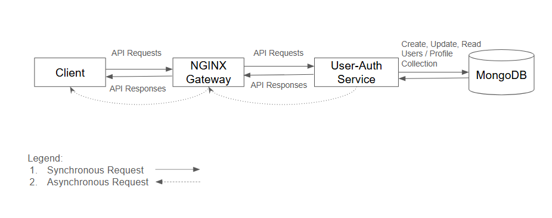

# Authentication & User Profile Service

A comprehensive authentication and user profile management microservice designed for collaborative applications. Handles user registration, email verification, JWT-based authentication, session management, and user profile operations.

---

## Table of Contents

- [Architecture](#architecture)
- [API Endpoints](#api-endpoints)
- [Authentication Flow](#authentication-flow)
- [Design Choices](#design-choices)
- [Database Structure](#database-structure)
- [Environment Configuration](#environment-configuration)
- [Setup and Running](#setup-and-running)
- [Development Notes](#development-notes)

---

## Architecture

**Overall Authentication Service Architecture**


The authentication service consists of:
- **Better Auth Core:** Manages authentication logic, session handling, and JWT generation.
- **Profile Controller:** Handles CRUD operations for user profiles.
- **Auth Controller:** Validates JWT tokens for Nginx auth_request integration.
- **MongoDB:** Stores user accounts, sessions, profiles, and verification tokens.
- **Resend:** Email delivery service for verification and password reset emails.
- **Nginx Integration:** JWT verification endpoint protects routes across microservices.

**Service Role:**
1. **Authentication Provider:** User registration, login, and session management
2. **JWT Authority:** Issues and verifies JWT tokens for inter-service communication
3. **Userand ProfileData Store:** Manages user profiles and User auth related data
4. **Email Gateway:** Sends verification and password reset emails

**Controllers** - Logically separated to ensure domain separation to be between User API end points and Auth related endpoints.
**Routes** - Routes are protected as needed. For example verifying JWT will not require middleware auth check, other methods like editing profiles will.
**Note:** This service does not run standalone - it must be deployed as part of a Docker Compose setup with its dependencies (MongoDB, Nginx, other services).


---

## API Endpoints

### Better Auth Endpoints

| Operation | HTTP Request | URI | HTTP Response |
|-----------|--------------|-----|----------------|
| Register new user | POST | `/api/auth/sign-up/email` | **201:** User created, verification email sent<br>**400:** Validation error<br>**409:** Email already exists |
| Sign in user | POST | `/api/auth/sign-in/email` | **200:** Session created, returns user and session<br>**401:** Invalid credentials<br>**403:** Email not verified |
| Sign out user | POST | `/api/auth/sign-out` | **200:** Session terminated |
| Verify email | GET | `/api/auth/verify-email?token=<token>` | **200:** Email verified, profile created<br>**400:** Invalid or expired token |
| Resend verification email | POST | `/api/auth/send-verification-email` | **200:** Verification email sent<br>**400:** Email already verified |
| Request password reset | POST | `/api/auth/reset-password` | **200:** Reset email sent<br>**404:** User not found |
| Set new password | POST | `/api/auth/set-password` | **200:** Password updated<br>**400:** Invalid or expired token |
| Get current session | GET | `/api/auth/get-session` | **200:** Returns user and session<br>**401:** No active session |
| Get JWKS | GET | `/api/auth/jwks` | **200:** Returns JSON Web Key Set for JWT verification |

### JWT Verification Endpoint

| Operation | HTTP Request | URI | HTTP Response |
|-----------|--------------|-----|----------------|
| Verify JWT token (for Nginx) | GET | `/api/jwt/verify-jwt` | **200:** Token valid, returns userId and email<br>**401:** Invalid or expired token |

### User Profile Management

| Operation | HTTP Request | URI | HTTP Response |
|-----------|--------------|-----|----------------|
| Get user profile | GET | `/api/v1/users/:id/profile` | **200:** Profile data returned<br>**401:** Unauthorized<br>**403:** Forbidden<br>**404:** Profile not found |
| Create user profile | POST | `/api/v1/users/:id/profile` | **201:** Profile created<br>**401:** Unauthorized<br>**409:** Profile already exists |
| Update user profile | PUT | `/api/v1/users/:id/profile` | **200:** Profile updated<br>**400:** Validation error<br>**401:** Unauthorized<br>**403:** Forbidden<br>**404:** Profile not found |
| List all profiles | GET | `/api/v1/users?page=1&limit=10` | **200:** Paginated profile list<br>**500:** Internal server error |

### Health Check

| Operation | HTTP Request | URI | HTTP Response |
|-----------|--------------|-----|----------------|
| Service health check | GET | `/health` | **200:** Service status and configuration info |

---

## Authentication Flow

### 1. User Registration Flow

```
User → POST /api/auth/sign-up/email
  ↓
Service creates user in `users` collection
  ↓
Verification email sent via Resend
  ↓
User clicks verification link
  ↓
GET /api/auth/verify-email?token=xxx
  ↓
Email verified, profile created in `profiles` collection
  ↓
User can now sign in
```

### 2. Sign In Flow

```
User → POST /api/auth/sign-in/email
  ↓
Better Auth validates credentials
  ↓
Session created in `sessions` collection
  ↓
Session cookie set (httpOnly, secure in production)
  ↓
JWT token issued (30min expiration)
  ↓
User receives session cookie + JWT token
```

### 3. Protected Request Flow

```
Client → Request to /api/v1/users/:id/profile with Bearer token
  ↓
Middleware: requireAuth validates session
  ↓
Middleware: requireOwnership checks userId matches :id
  ↓
Controller processes request
  ↓
Response sent to client
```

### 4. Nginx JWT Verification Flow

```
Client → Request to protected route via Nginx
  ↓
Nginx → auth_request to /api/jwt/verify-jwt
  ↓
Service validates JWT with cached JWKS
  ↓
Returns 200 (valid) or 401 (invalid)
  ↓
Nginx allows or blocks original request
```

---

## Design Choices

1. **Better Auth Framework**
   - Provides robust, production-ready authentication
   - Open Source authentication framework
   - Handles complex security concerns (password hashing, session management, CSRF protection)
   - Extensible plugin system (JWT, OpenAPI documentation)
   - Significantly reduces implementation time vs. building custom auth

2. **JWT + Session Hybrid Approach**
   - **Session cookies** for web application authentication (7-day expiration, daily refresh)
   - **JWT tokens** for inter-service authentication and stateless verification (30-minute expiration) - Needed for the `matching-service` and `collab-service` for user identification

3. **JWKS Caching**
   - JSON Web Key Set cached in memory for efficient JWT verification
   - Single initialization on service startup

4. **Automatic Profile Creation**
   - Profiles auto-created after email verification via `afterEmailVerification` hook
   - Eliminates manual profile creation step for users

5. **MongoDB Adapter**
   - Better Auth's native MongoDB adapter ensure default profile creation with certain User fields
   - Direct integration with existing MongoDB infrastructure

6. **Email Service Integration**
   - **Resend** chosen for reliability, developer experience, and React Email template support, also free tier
   - React Email templates provide component-based email design


---

## Database Structure

### Collections

#### `account` Collection
Managed by Better Auth. Stores authentication data.

| Field | Type | Description | Constraints |
|-------|------|-------------|-------------|
| `_id` | ObjectId | default Mongo ID| Auto-generated |
| `accountId` | string | User's display name | Required |
| `providerId` | string | User's email address | Unique, indexed, required |
| `userId` | string | Email verification status | Default: false | (All other profiles Foreign Key this)
| `password` | string | Hashed password | Managed by Better Auth |
| `createdAt` | Date | Account creation timestamp | Auto-generated |
| `updatedAt` | Date | Last update timestamp | Auto-updated |

#### `users` Collection
Managed by Better Auth. Stores user data.

| Field | Type | Description | Constraints |
|-------|------|-------------|-------------|
| `_id` | ObjectId | User ID (default Mongo generated)| Auto-generated (Same as account `userID`) | 
| `name` | string | User's display name | Required |
| `email` | string | User's email address | Unique, indexed, required |
| `emailVerified` | boolean | Email verification status | Default: false |
| `createdAt` | Date | Account creation timestamp | Auto-generated |
| `updatedAt` | Date | Last update timestamp | Auto-updated |

#### `profiles` Collection
Managed by Profile Controller. Stores user profile data.

| Field | Type | Description | Constraints |
|-------|------|-------------|-------------|
| `_id` | ObjectId | MongoDB document ID | Auto-generated |
| `userId` | string | References users.id | Unique, indexed, required |
| `handles` | string[] | Array of user handles | Default: [] |
| `biography` | string | User biography | Default: "" |
| `problemsSolved` | Object[] | Array of solved problems | Default: [] |
| `problemsSolved.problemId` | string | Problem identifier | Required |
| `problemsSolved.solvedAt` | Date | Solution timestamp | Required |
| `problemsSolved.language` | string | Programming language | Required |
| `createdAt` | Date | Profile creation timestamp | Auto-generated |
| `updatedAt` | Date | Last update timestamp | Auto-updated |

#### `sessions` Collection
Managed by Better Auth. Stores active sessions.

| Field | Type | Description | Constraints |
|-------|------|-------------|-------------|
| `_id` | ObjectId | Session ID | Auto-generated |
| `userId` | string | References users.id | Indexed |
| `expiresAt` | Date | Session expiration | 7 days from creation |
| `token` | string | Session Token | Auto-generated |
| `createdAt` | Date | Session creation timestamp | Auto-generated |
| `updatedAt` | Date | Last update timestamp | Auto-updated |
| `ipAddress` | String | IP address as String | Auto-generated |
| `userAgent` | String | Browser details | Auto-generated |


#### `jwks` Collection
Managed by Better Auth. Stores email verification and password reset tokens.

| Field | Type | Description | Constraints |
|-------|------|-------------|-------------|
| `_id` | ObjectId | MongoDB document ID | Auto-generated |
| `publicKey` | string | Public Key for JWT verification | String |Auto-generated |
| `privateKey` | string | Private Key to generate JWT (MUST NOT BE LEAKED) | Auto-generated |
| `createdAt` | Date | Key creation time | Auto-generated |

---

## Environment Configuration
Refer to `README.md` for the NEEDED configuration to run all services instead.

### Used Environment variables
```env
# ============================================
# Server Configuration
# ============================================
AUTH_PORT=8000                              # Port the service runs on inside container
BASE_URL=http://auth-service:8000          # Internal service URL for Docker network

# ============================================
# Database Configuration
# ============================================
DB_LOCAL_URI=mongodb://mongo:27017         # MongoDB connection string (use service name in Docker)
DB_NAME=your_database_name                 # Database name

# ============================================
# Email Service (Resend)
# ============================================
RESEND_API_KEY=re_xxxxxxxxxxxxx            # Resend API key
EMAIL_FROM=noreply@yourdomain.com          # Sender email address

# ============================================
# JWT Configuration
# ============================================
AUTH_SERVICE_BASE_URL=http://auth-service:8000    # JWT issuer and audience
AUTH_SERVICE_JWKS=http://auth-service:8000/api/auth/jwks  # JWKS endpoint for JWT verification

# ============================================
# Environment
# ============================================
NODE_ENV=development                        # development or production
```

### Environment Variables Reference

| Variable | Purpose | Default | Required |
|----------|---------|---------|----------|
| `AUTH_PORT` | Internal container port | 8000 | No |
| `BASE_URL` | Service URL in Docker network | - | Yes |
| `FRONTEND_URL` | Frontend URL for CORS | - | Yes |
| `DB_LOCAL_URI` | MongoDB connection string | - | Yes |
| `DB_NAME` | Database name | - | Yes |
| `RESEND_API_KEY` | Resend API key | - | Yes |
| `EMAIL_FROM` | Sender email address | - | Yes |
| `AUTH_SERVICE_BASE_URL` | JWT issuer/audience | http://auth-service:8000 | No |
| `AUTH_SERVICE_JWKS` | JWKS endpoint URL | - | Yes |
| `NODE_ENV` | Environment mode | development | No |

---

## Setup and Running

### Prerequisites
- Docker & Docker Compose installed
- Node.js (v18+) & npm installed
- MongoDB instance (handled by Docker Compose)
- Resend API key

### Installation

To install dependencies locally:

```bash
npm install
```

### Start Service

Ensure Docker is running in the background before executing:

```bash
docker-compose up --build -d
```

The service endpoints are not exposed for production, For development only, edit `docker-compose.yaml` for the main file and expose the port to 8000:
Dev Mode:
- API: `http://localhost:8000`
- Auth endpoints: `http://localhost:8000/api/auth`
- Profile endpoints: `http://localhost:8000/api/v1/users`

### View Logs

```bash
docker-compose logs -f auth-service
```

### Stop Service

```bash
docker-compose down
```

### Rebuild After Changes

```bash
docker-compose up -d --build auth-service
```

---

## Development Notes

### AI Assistance Disclosure

All source files include AI assistance disclosures documenting:
- **Tools Used:** ChatGPT (GPT-5), Claude 4.5 Sonnet
- **Dates:** 2025-09-14, 2025-09-25, 2025-11-09
- **Scope:** Initial code generation, JWT verification, debugging, boilerplate
- **Author Review:** Verified for correctness by reading code and runtime testing

### Security Features

- ✅ Email verification required before sign-in
- ✅ Passwords hashed with bcrypt via Better Auth
- ✅ HttpOnly, secure session cookies in production
- ✅ JWT tokens with 30-minute expiration
- ✅ JWKS caching for efficient JWT verification
- ✅ Ownership verification (users can only access their own data)
- ✅ CORS configuration with allowed origins
- ✅ Request validation with Zod schemas
- ✅ Comprehensive logging without exposing sensitive data

### Middleware Chain

**Protected Route Example:**
```typescript
router.put(
  "/:id/profile",
  requireAuth,        // 1. Validate session
  requireOwnership,   // 2. Verify user owns resource
  ProfileController.patchProfile  // 3. Process request
);
```

### Profile Auto-Creation

Profiles are automatically created at two points:
1. **After email verification** (`afterEmailVerification` hook) - Primary method
2. **On user creation** (`databaseHooks.user.create.after`) - Backup method

This dual-hook approach ensures every verified user has a profile without manual intervention.

### Logging Output

The service provides detailed logging for debugging:

```
🔐 Initializing JWKS from: http://auth-service:8000/api/auth/jwks
✅ JWKS cache initialized successfully
Server is running on port 8000

🔍 [AUTH_VERIFY] Request received: { method: 'GET', hasAuthHeader: true }
🔑 [AUTH_VERIFY] Token prefix: eyJhbGciOiJSUzI1NiIs...
✅ [AUTH_VERIFY] JWT VALIDATED SUCCESSFULLY { userId: 'user_123', duration: '45ms' }
```

### Common Issues & Solutions

**JWKS Not Initializing**
```
Error: AUTH_SERVICE_JWKS environment variable is not set
```
**Solution:** Ensure `AUTH_SERVICE_JWKS` environment variable points to the correct JWKS endpoint.

**Email Not Sending**
- Verify `RESEND_API_KEY` is valid
- Confirm `EMAIL_FROM` is verified in Resend dashboard
- Check Resend logs for delivery issues

**JWT Verification Fails**
- Ensure JWT `issuer` and `audience` match configuration
- Verify JWKS endpoint is accessible from within Docker network
- Check token hasn't expired (30-minute default)

**Profile Not Created**
- Confirm email verification completed successfully
- Review service logs for hook execution errors
- Manually check if profile exists in `profiles` collection using MongoDB Compass

