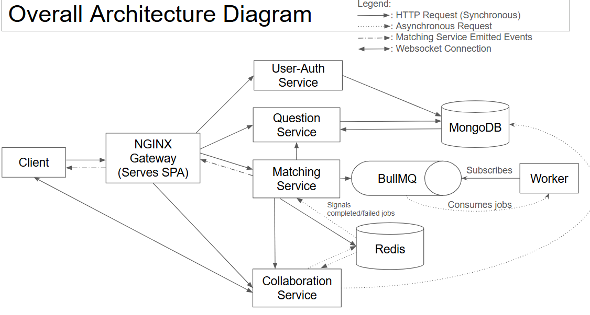

# API Gateway Documentation

A centralized API Gateway using NGINX to handle authentication, routing, and service orchestration for the microservices architecture.

---

## Table of Contents

- [Primary Reason for API Gateway](#primary-reason-for-api-gateway)
- [Why NGINX](#why-nginx)
- [Architecture Overview](#architecture-overview)
- [Routing Configuration](#routing-configuration)
- [Authentication Flow](#authentication-flow)
- [Scalability and Reliability](#scalability-and-reliability)
- [Networking & Ingress](#networking--ingress)
- [WebSocket Support](#websocket-support)
- [Caching Strategy](#caching-strategy)
- [Setup and Configuration](#setup-and-configuration)

---

## Primary Reason for API Gateway

**Centralized Authentication and Authorization**

- **JWT Authentication:** User-Auth Service uses JWT authentication for user verification and identification across all microservices.
- **Separation of Concerns:** Centralizes authentication and authorization logic to the User-Auth Service, preventing code duplication across microservices.
- **Single Point of Verification:** All incoming requests are authenticated at the gateway level before reaching backend services.
- **Service Simplification:** Backend services can trust authenticated requests and focus on business logic rather than authentication concerns.
- **User Identification:** All services can identify users by their `userId` from validated JWT tokens and designate appropriate resource access.

---

## Why NGINX

**Production-Ready Reverse Proxy**

- **Open Source:** Battle-tested, open-source software with proven reliability in production environments at scale (e.g., Netflix).
- **Purpose-Built:** Designed specifically for reverse proxy operations, handling request routing between frontend clients and backend services.

**Security Benefits**
- **Single Entry Point:** Reduces attack surface by exposing only one service to the public internet.

---

## Architecture Overview

---

## Routing Configuration

| Service | Path Pattern | Port | Authentication Required | Special Configuration |
|---------|-------------|------|------------------------|----------------------|
| User-Auth Service | `/api/users/*` | 8000 | Yes | Public endpoints for User Profile operations and User Data Updates |
| Auth Service | `/api/auth/*` | 8000 | No | Authentication, Authorisation, Token generation and refresh |
| Question Service | `/api/questions/*` | 3013 | Yes | Standard JWT verification |
| Matching Service | `/api/matching/*` | 3001 | Yes | SSE support, query param token handling |
| Collaboration Service | `/api/collab/*` | 8081 | Yes | WebSocket support |
| Chat Service | `/api/chat/*` | 8082 | Yes | WebSocket support |
| Frontend | `/` | N/A | No | Static file serving with HTML cache control |

---

## Authentication Flow

**JWT Verification Process**


1. **Client Request:** Client sends request with JWT token in `Authorization` header (or query parameter for SSE/WebSocket).

2. **NGINX Intercepts:** Gateway extracts token from request:
   - Standard requests: `Authorization: Bearer <token>`
   - SSE/WebSocket: Query parameter `?token=<token>`

3. **Internal Verification:** NGINX makes internal subrequest to `/auth_verify` endpoint:
   - Forwards JWT to User-Auth Service
   - User-Auth Service validates token using JWKS
   - Returns 200 (valid) or 401 (invalid)

4. **Routing Decision:**
   - **Valid Token:** Request forwarded to target service with original headers
   - **Invalid Token:** 401 error returned to client, request blocked

5. **Service Processing:** Backend service receives authenticated request and processes business logic.

**Authentication Configuration**

```nginx
# Internal JWT verification endpoint
location = /auth_verify {
    internal;  # Only accessible via auth_request
    proxy_pass http://auth-service:8000/api/jwt/verify-jwt;
    
    proxy_pass_request_body off;
    proxy_set_header Content-Length "";
    proxy_set_header Authorization $auth_token;
}

# Protected endpoint example
location /api/questions/ {
    set $auth_token $http_authorization;
    auth_request /auth_verify;  # Triggers JWT verification
    
    # Only executed if auth_request returns 2xx
    proxy_pass http://question-service:3013;
}
```

---

## Scalability and Reliability

**Current Capabilities**

- **Reverse Proxy:** Efficiently handles and routes incoming requests to appropriate backend services.

**Future Scaling Opportunities**

1. **Caching Layer**
   - Cache frequent question queries to reduce database load
   - Store static content and API responses with TTL-based invalidation
   - Reduce latency for repeated requests

2. **Rate Limiting**
   - Prevent excessive API calls from individual clients
   - Protect backend services from overload and DDoS attacks
   - Implement per-user or per-IP request throttling

3. **Load Balancing**
   - Distribute traffic across multiple instances of each service
   - Improve reliability through redundancy
   - Enable zero-downtime deployments
   - Support horizontal scaling as user base grows

4. **Circuit Breaking**
   - Detect failing backend services and stop forwarding requests
   - Provide graceful degradation and fallback responses
   - Allow services time to recover from failures

---

## Networking & Ingress

**Ingress Controller**

- **Primary Gateway:** NGINX functions as the primary ingress controller and API Gateway for all frontend requests.
- **Single Entry Point:** All external client traffic enters through NGINX before reaching microservices.
- **Authentication Offloading:** NGINX handles JWT verification, removing authentication burden from backend services.

**Port Exposure**

- **Public Ports:** Only NGINX Gateway exposes ports to the public internet:
  - Port 80: HTTP traffic
  
- **Internal Ports:** All backend services expose ports only within the internal Docker network:
  - `auth-service:8000`
  - `question-service:3013`
  - `matching-service:3001`
  - `collab-service:8081`
  - `chat-service:8082`

**API Gateway Routing Rules**

Path-based routing directs requests to appropriate services:

- `/api/users/*` → User-Auth Service (public authentication endpoints)
- `/api/auth/*` → Auth Service (token operations)
- `/api/questions/*` → Question Service (protected, requires JWT)
- `/api/matching/*` → Matching Service (protected, SSE support)
- `/api/collab/*` → Collaboration Service (protected, WebSocket support)
- `/api/chat/*` → Chat Service (protected, WebSocket support)
- `/*` → Frontend static files (served by NGINX)

**Network Isolation**

- Backend services are isolated from direct external access
- Inter-service communication occurs over internal Docker network
- Only NGINX can route external requests to backend services
- Reduces attack surface and improves security posture

---

## WebSocket Support

**Real-Time Communication Handling**

NGINX provides native support for WebSocket connections required by Collaboration and Chat services.

**Configuration Details**

```nginx
location /api/collab/ {
    proxy_http_version 1.1;
    proxy_set_header Upgrade $http_upgrade;
    proxy_set_header Connection $connection_upgrade;
    
    proxy_read_timeout 86400s;  # 24-hour timeout
    proxy_send_timeout 86400s;
}
```

**Key Features**

- **Protocol Upgrade:** Handles HTTP to WebSocket protocol upgrade seamlessly.
- **Connection Persistence:** Maintains long-lived connections for real-time updates.
- **Extended Timeouts:** Configured with 24-hour timeouts to support extended collaboration sessions.
- **Token Authentication:** Supports query parameter token passing for WebSocket handshake authentication.

**Use Cases**

- **Collaboration Service:** Real-time code editing and cursor position synchronization
- **Chat Service:** Instant messaging between matched users
- **Matching Service:** Server-Sent Events (SSE) for real-time match notifications

---

## Caching Strategy

**HTML Cache Control**

Frontend HTML files use strict cache policies to ensure security:

```nginx
location ~* \.html$ {
    add_header Cache-Control "no-cache, no-store, must-revalidate";
}
```

**Rationale:**
- **Authentication Concerns:** HTML may contain authentication state or user-specific content
- **ETag Validation:** Clients must revalidate with server on every request
- **No Intermediate Storage:** Prevents caching proxies from serving stale authenticated content
- **Offline Prevention:** Ensures users cannot access old versions when offline

**Static Asset Caching**

Static assets (CSS, JS, images) use browser caching for performance:
- Served via NGINX's efficient static file handling
- Future enhancement: Add cache headers for versioned assets

---

## Setup and Configuration

### Prerequisites

- Docker & Docker Compose installed
- Backend services containerized and running
- JWT authentication configured in User-Auth Service

### Configuration File Structure

```
nginx.conf
├── events {} - Connection processing settings
├── http {}
    ├── MIME types and compression
    ├── Logging configuration
    ├── Authentication mapping
    └── server {}
        ├── /auth_verify - Internal JWT verification
        ├── /api/users/* - Public auth endpoints
        ├── /api/questions/* - Protected question endpoints
        ├── /api/matching/* - Protected matching with SSE
        ├── /api/collab/* - Protected WebSocket collaboration
        ├── /api/chat/* - Protected WebSocket chat
        └── /* - Frontend static files
```

### Start Gateway

```bash
docker-compose up nginx-gateway -d
```

### Configuration Verification

```bash
# Test configuration syntax
docker exec nginx-gateway nginx -t

# Reload configuration without downtime
docker exec nginx-gateway nginx -s reload

# View access logs
docker logs nginx-gateway -f

# Check authentication logs
docker exec nginx-gateway tail -f /var/log/nginx/auth_access.log
```

### Environment Variables

No environment variables required - routing uses Docker service names for internal DNS resolution.

---

## Design Choices

**Why Internal `/auth_verify` Endpoint**

- **Security:** Verification endpoint not exposed to external clients
- **Simplicity:** No need for separate authentication middleware in each service
- **Centralization:** Single source of truth for authentication logic

**Why Path-Based Routing**

- **Simplicity:** Easy to understand and maintain routing rules
- **Flexibility:** Can easily add new services without complex configuration
- **Compatibility:** Works seamlessly with frontend routing and service discovery


**Process of Authentication for all backend services**: 

All backend services need to implement this specific line in order to ensure the user is authenticated and their  JWT is valid. This means in the `nginx.conf`, all backend services must contain this line under their  `location /api/*`

Either 
```
set $auth_token "";
if ($arg_token) {
    set $auth_token "Bearer $arg_token";
}
auth_request /auth_verify;


```
OR 

```
set $auth_token $http_authorization;

auth_request /auth_verify;

```
---

### Acknowledgement
AI was used to generate this README.md file with the help of the nginx configuration file, given the design choices of the nginx we already have incode.

AI Assistance Disclosure

**Tool:** Claude (model: Sonnet 4.5)

**Scope:**
Generated the README.md given our current nginx conf with the discussion of why we chose a GATEWAY.

**Author Review:**
- Verified correctness of README.md
- For all design choices and architecture design, it is consistent with what we have inputted.